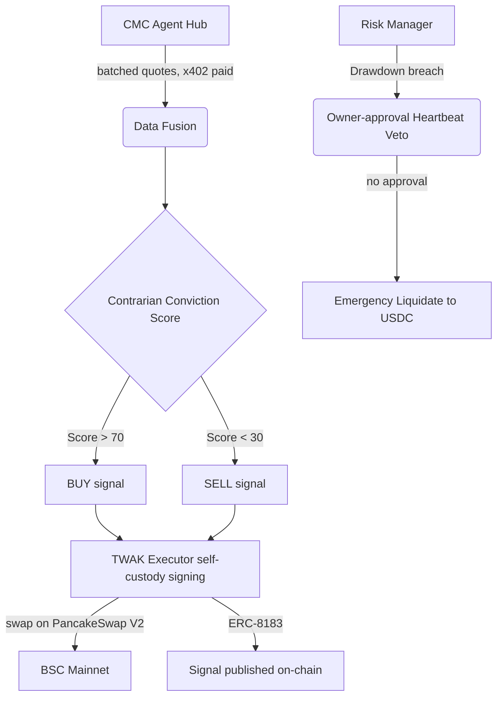

# The Omniscient Contrarian

An autonomous, self-custody AI trading agent for the **BNB Hack: AI Trading Agent Edition** (CoinMarketCap × Trust Wallet), Track 1. It fades crowded short-term moves that aren't backed by volume — a contrarian mean-reversion strategy driven by live CoinMarketCap Agent Hub data and executed self-custody on BSC.

See [SUBMISSION.md](SUBMISSION.md) for the full strategy writeup.

## Architecture


## How the pieces map to the stack
- **CMC Agent Hub** — per-token quotes via the x402 REST surface (`/x402/v3/cryptocurrency/quotes/latest`), batched into **one paid request per epoch** (~$0.01).
- **CMC Pro API** — Fear & Greed regime + global metrics (makes the strategy regime-aware), and a reliability fallback for quotes.
- **x402** — real EIP-3009 `transferWithAuthorization` (USDC on Base), gasless. Routed through TWAK's native x402 when enabled, else direct ethers signing.
- **Self-custody execution** — every swap signed locally by the agent's own key (ethers + PancakeSwap V2). A Trust Wallet Agent Kit path is wired in behind `USE_TWAK` as an option (off by default).
- **BNB AI Agent SDK** — ERC-8004 identity registration (`scripts/registerBnbSdk.py`).

## Prerequisites (funding)
| Chain | Asset | Purpose |
|---|---|---|
| Base | **USDC** (~$10) | x402 data payments (gasless; no ETH needed) |
| BSC | **USDT** | trading capital — the agent trades USDT↔token so value stays in an in-scope asset |
| BSC | **BNB** (small, ~0.01–0.02) | gas only |

> The agent uses **USDT as its base currency** (an eligible BEP-20), so the portfolio is always held in a competition-counted asset rather than native BNB.

## Setup
1. Install dependencies: `npm install`
2. Copy env: `cp .env.example .env`, then fill in `TWAK_PRIVATE_KEY` and addresses.
3. (Optional but recommended) Enable the Trust Wallet Agent Kit as the execution layer:
   ```bash
   npm i -g @trustwallet/cli           # installs `twak`
   # get Access ID + HMAC Secret from https://portal.trustwallet.com (saved to ~/.twak)
   # then in .env:  USE_TWAK=true
   ```
   With `USE_TWAK=false` (default) the agent uses direct self-custody EIP-3009 signing.
4. (Optional) Compile contracts: `npx hardhat compile`

## Run
```bash
npm start            # starts the agent loop + status API on :3000
npm run backtest     # backtest the contrarian strategy on historical data
npm test             # unit tests (pure, no network/payments)
```

## Validate the live x402 data path (~$0.01)
```bash
npx ts-node scripts/validateX402.ts
```

## Status API
- `GET  /status` — live portfolio, conviction scores, trades, x402 spend
- `GET  /heartbeat/status` — whether the agent is awaiting owner approval
- `POST /heartbeat/approve` — owner approves continuing past a drawdown breach (else it auto-liquidates)

## Demo Video
_TODO: link your recording. Storyboard in [PITCH_DECK.md](PITCH_DECK.md)._
